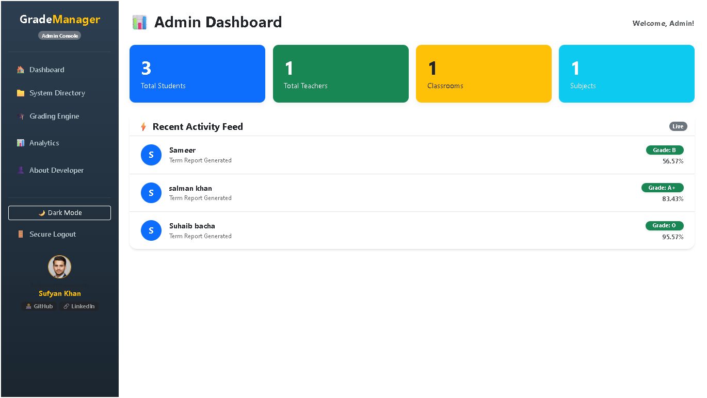
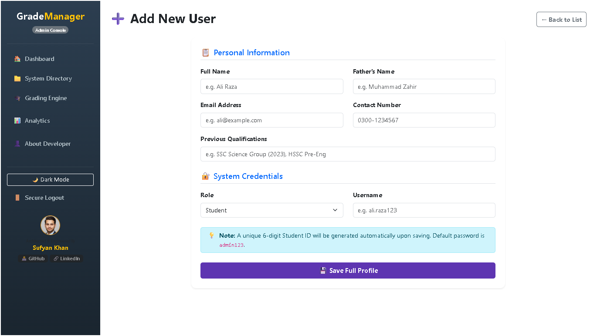
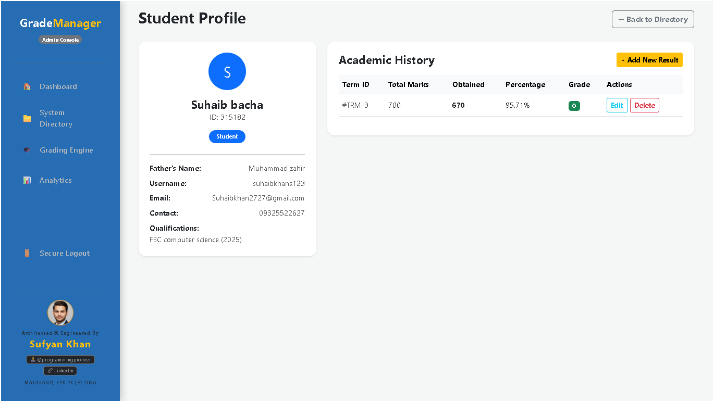
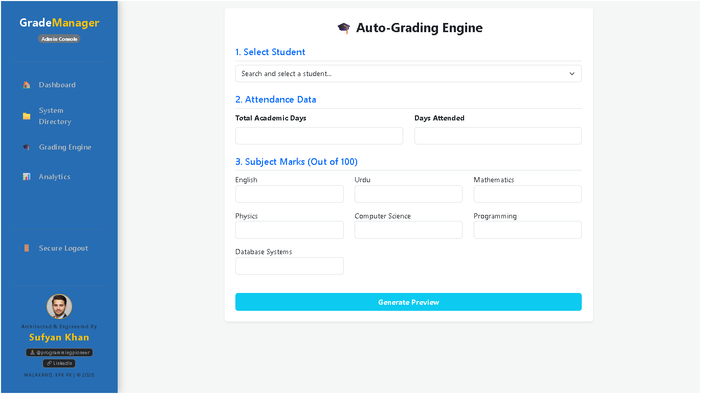
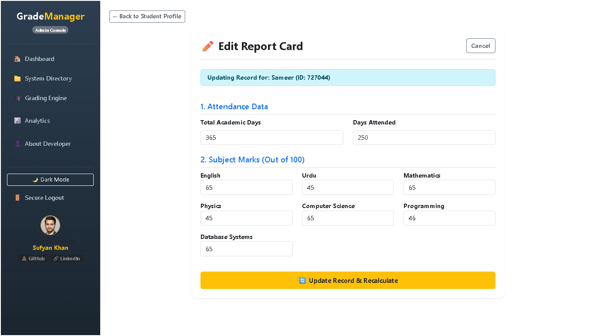
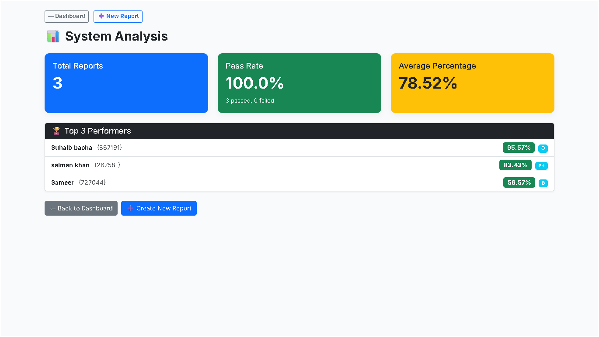

<div align="center">

# 🎓 GradeManager
### Admin Console — Student Grade Management System

**A full-featured web-based academic management platform for schools and institutions.**  
Built with structured data handling, automated grade calculation, and a clean admin interface.

<br/>

[](https://github.com/programmingpioneer)
[](https://github.com/programmingpioneer)
[](LICENSE)
[](https://github.com/programmingpioneer)
[](https://www.linkedin.com/in/sufyan-khan-12321b340)

</div>

---

## 📌 Table of Contents

- [About the Project](#-about-the-project)
- [Key Features](#-key-features)
- [Screenshots](#-screenshots)
- [Tech Stack](#-tech-stack)
- [Getting Started](#-getting-started)
- [Project Structure](#-project-structure)
- [Grade Scale](#-grade-scale)
- [Author](#-author)
- [License](#-license)

---

## 📖 About the Project

**GradeManager** is a browser-based Academic Administration System designed to simplify how educational institutions record, update, and report student performance data.

The system provides school administrators with a centralized dashboard to manage students, assign subject marks, auto-calculate grades, track attendance, and generate instant performance analytics — all from a clean, intuitive web interface.

> Built as a real-world capstone project demonstrating front-end development, data management logic, and UI/UX design principles.

---

## ✨ Key Features

| Feature | Description |
|---|---|
| 🏠 **Admin Dashboard** | Live overview of total students, teachers, classrooms, and subjects with a real-time activity feed |
| ➕ **Add New User** | Enroll students or teachers with full personal info, role assignment, and auto-generated 6-digit ID |
| 🎓 **Auto-Grading Engine** | Input subject marks and attendance; system auto-calculates grade, percentage, and pass/fail status |
| ✏️ **Edit Report Card** | Update any student's marks and trigger an instant recalculation of their academic result |
| 👤 **Student Profile** | Full profile view with personal info, qualifications, and complete academic history table |
| 📊 **Performance Analytics** | Class-wide statistics — system average, pass/pass rate, total reports, and an Elite Leaderboard (Top 3) |
| 🔐 **Role-Based Access** | Supports Student and Teacher roles with a secure login/logout system |
| 📋 **Academic History** | Per-student term-by-term result records with Edit and Delete actions |

---

## 📸 Screenshots

> ⚡ Click any image to view it in full resolution.

---

### 🏠 Admin Dashboard
The central hub showing live institution statistics and a real-time student activity feed with grade badges.



---

### ➕ Add New User
Enroll new students or staff with personal info, contact details, previous qualifications, and system credentials. A unique **6-digit Student ID** is auto-generated on save.



---

### 👤 Student Profile
Individual student profile card displaying personal details, username, email, qualification history, and a full **Academic History** table with term-by-term results.



---

### 🎓 Auto-Grading Engine
Select a student, enter attendance data and subject marks (out of 100), then click **Generate Preview** to auto-calculate their grade and percentage instantly.



---

### ✏️ Edit Report Card
Update an existing student's attendance and subject marks. Click **Update Record & Recalculate** to refresh their grade automatically.



---

### 📊 Performance Analysis
Class-wide analytics showing system average, pass rate with pass/fail count, total reports processed, and a ranked **Elite Leaderboard** for the top 3 performers.



---

## 🛠️ Tech Stack

```
Frontend   →  HTML5, CSS3, JavaScript (Vanilla)
Styling    →  Custom CSS  |  Responsive Layout
Data       →  Client-side structured data management
Logic      →  Auto-grade calculation engine (JavaScript)
Icons      →  Emoji-based  |  Unicode symbols
Hosting    →  Browser-based  (no server required)
```

---

## 🚀 Getting Started

### Prerequisites
- Any modern web browser (Chrome, Firefox, Edge, Safari)
- No installation or server setup required

### Run Locally

```bash
# 1. Clone the repository
git clone https://github.com/programmingpioneer/GradeManager.git

# 2. Navigate into the project folder
cd GradeManager

# 3. Open in your browser
# Simply double-click index.html
# OR right-click → Open with → Browser
```

> ✅ That's it. No npm, no build tools, no dependencies.

### Default Login Credentials
```
Username : admin
Password : admin123
```
> Students are auto-assigned the default password `admin123` which they can change on first login.

---

## 📁 Project Structure

```
GradeManager/
│
├── index.html              # Login / Entry point
├── dashboard.html          # Admin Dashboard
├── add-user.html           # Add New Student / Teacher
├── directory.html          # System Directory (student list)
├── student-profile.html    # Individual Student Profile
├── grading-engine.html     # Auto-Grading Engine
├── edit-report.html        # Edit Report Card
├── analytics.html          # Performance Analysis
│
├── css/
│   ├── style.css           # Global styles
│   ├── sidebar.css         # Navigation sidebar
│   └── components.css      # Cards, tables, forms
│
├── js/
│   ├── data.js             # Student data management
│   ├── grader.js           # Grade calculation logic
│   ├── auth.js             # Login / logout handling
│   └── analytics.js        # Stats and leaderboard logic
│
├── screenshots/            # Project screenshots for README
│   ├── Dashboard.png
│   ├── Add_New_user.png
│   ├── Student_profile.png
│   ├── Grading_engine.png
│   ├── Edit_student_profile.png
│   └── Analysis.png
│
└── README.md
```

---

## 📐 Grade Scale

The system uses the following academic grading criteria:

| Percentage Range | Letter Grade | Status |
|:---:|:---:|:---:|
| 90% – 100% | **A+** | ✅ Pass |
| 80% – 89% | **A** | ✅ Pass |
| 75% – 79% | **B+** | ✅ Pass |
| 70% – 74% | **B** | ✅ Pass |
| 65% – 69% | **C+** | ✅ Pass |
| 60% – 64% | **C** | ✅ Pass |
| 50% – 59% | **D** | ✅ Pass |
| Below 50% | **F** | ❌ Fail |

---

## 📚 Subjects Covered

The grading engine supports the following subjects (customizable):

`English` · `Urdu` · `Mathematics` · `Physics` · `Computer Science` · `Programming` · `Database Systems`

---

## 🤝 Contributing

Contributions, issues, and feature requests are welcome!

```bash
# Fork the repo
# Create your feature branch
git checkout -b feature/YourFeatureName

# Commit your changes
git commit -m "Add: YourFeatureName"

# Push to the branch
git push origin feature/YourFeatureName

# Open a Pull Request
```

---

## 👨‍💻 Author

<div align="center">


### **Sufyan Khan**
*F.Sc Computer Science (Grade A) · Aspiring Software Engineer*  
*Sakhakot, Malakand, Khyber Pakhtunkhwa, Pakistan*

[](https://github.com/programmingpioneer)
[](https://www.linkedin.com/in/sufyan-khan-12321b340)
[](https://x.com/programerPioner)
[](mailto:7t7sufyan@gmail.com)

> *"Building tools that solve real problems — one project at a time."*

</div>

---

## 📄 License

This project is licensed under the **MIT License** — see the [LICENSE](LICENSE) file for details.

```
MIT License — Free to use, modify, and distribute with attribution.
© 2026 Sufyan Khan | github.com/programmingpioneer
```

---

<div align="center">

⭐ **If this project helped you, give it a star — it means a lot!** ⭐

Made with ❤️ from Malakand, KPK, Pakistan

</div>
