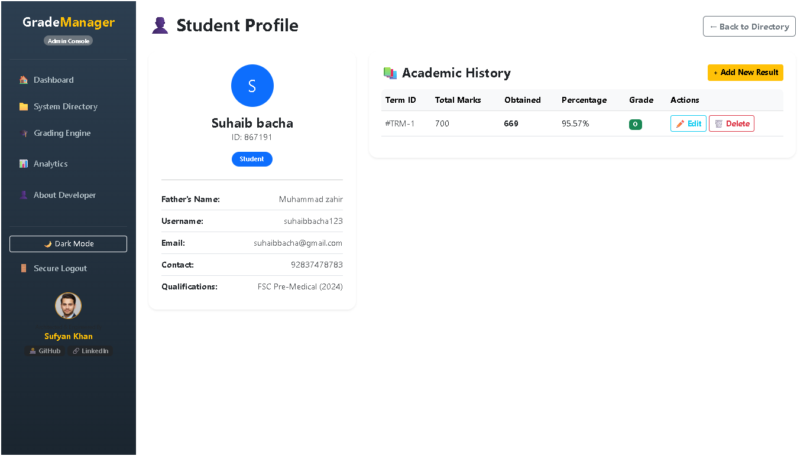

<div align="center">

# 🎓 Grade Manager
### Flask-Based Student Grade Management System

<br/>

<!-- Attractive Subtitle Box -->
<div style="background: linear-gradient(135deg, #667eea 0%, #764ba2 100%); padding: 20px; border-radius: 15px; display: inline-block; max-width: 700px;">
  <h3 style="color: white; margin: 0;">📱 Responsive | 🌙 Dark Mode | ⚡ Auto‑Grading</h3>
  <p style="color: #e0e0e0; margin-top: 10px; font-size: 1.1rem;">
    A full‑stack web app for managing student grades, attendance, and academic reports — built with <strong>Flask</strong>, <strong>SQLAlchemy</strong>, and <strong>Bootstrap 5</strong>, ready for <strong>Render</strong>.
  </p>
</div>

<br/>

[](https://github.com/programmingpioneer)
[](https://github.com/programmingpioneer)
[](LICENSE)
[](https://github.com/programmingpioneer)
[](https://www.linkedin.com/in/sufyan-khan-12321b340)

</div>

---

## 📌 Table of Contents

- [About the Project](#-about-the-project)
- [Key Features](#-key-features)
- [Screenshots](#-screenshots)
- [Tech Stack](#-tech-stack)
- [Getting Started](#-getting-started)
- [Project Structure](#-project-structure)
- [Deploy on Render](#-deploy-on-render)
- [Grade Scale](#-grade-scale)
- [Author](#-author)
- [License](#-license)

---

## 📖 About the Project

**Grade Manager** is a full‑stack web application that streamlines academic administration. It allows teachers/admins to manage students, record attendance and exam scores, auto‑calculate grades, and generate report cards — all through a clean, responsive interface that works on mobile, tablet, and desktop.

The system includes:
- A professional admin dashboard with live stats and recent activities.
- A student directory with quick profile pop‑ups (AJAX).
- An automatic grading engine that computes percentages and assigns grades based on configurable scales.
- Report card preview, save, edit, and delete functionality.
- A system analysis page with pass rates and a top‑performers leaderboard.
- **Dark mode** toggle (saved in browser).
- An **About Developer** page with project info and developer bio.

> Designed as a real‑world portfolio project demonstrating backend development, database management, and responsive frontend design.

---
## 📁 Project Structure

<div style="background: #0b1120; border: 1px solid #1e293b; border-radius: 20px; padding: 30px 25px; color: #e2e8f0; font-family: 'Segoe UI', system-ui, sans-serif; box-shadow: 0 12px 30px rgba(0,0,0,0.5); margin: 20px 0;">
  <h3 style="margin-top: 0; color: #fbbf24; font-size: 1.5rem; border-bottom: 1px solid #334155; padding-bottom: 10px;">📁 Project Structure</h3>
  <table style="width:100%; border-collapse: collapse; color: #cbd5e1;">
    <thead>
      <tr style="border-bottom: 1px solid #1e293b;">
        <th style="text-align: left; padding: 10px 8px; color: #94a3b8; font-weight: 600;">File / Directory</th>
        <th style="text-align: left; padding: 10px 8px; color: #94a3b8; font-weight: 600;">Description</th>
      </tr>
    </thead>
    <tbody>
      <tr style="border-bottom: 1px solid #1e293b;">
        <td style="padding: 8px;"><span style="color:#60a5fa;">📦 GradeManager/</span></td>
        <td style="padding: 8px; color:#94a3b8;">Root project folder</td>
      </tr>
      <tr style="border-bottom: 1px solid #1e293b;">
        <td style="padding: 8px 8px 8px 20px;"><span style="color:#f472b6;">app.py</span></td>
        <td style="padding: 8px; color:#cbd5e1;">Flask routes, logic &amp; auto‑grading engine</td>
      </tr>
      <tr style="border-bottom: 1px solid #1e293b;">
        <td style="padding: 8px 8px 8px 20px;"><span style="color:#f472b6;">database.py</span></td>
        <td style="padding: 8px; color:#cbd5e1;">DB configuration &amp; init (SQLite / MySQL)</td>
      </tr>
      <tr style="border-bottom: 1px solid #1e293b;">
        <td style="padding: 8px 8px 8px 20px;"><span style="color:#f472b6;">models.py</span></td>
        <td style="padding: 8px; color:#cbd5e1;">SQLAlchemy models (Student, Grade, ReportCard)</td>
      </tr>
      <tr style="border-bottom: 1px solid #1e293b;">
        <td style="padding: 8px 8px 8px 20px;"><span style="color:#f472b6;">requirements.txt</span></td>
        <td style="padding: 8px; color:#cbd5e1;">Python dependency list</td>
      </tr>
      <tr style="border-bottom: 1px solid #1e293b;">
        <td style="padding: 8px 8px 8px 20px;"><span style="color:#facc15;">📂 templates/</span></td>
        <td style="padding: 8px; color:#cbd5e1;">HTML templates (Jinja2)</td>
      </tr>
      <tr style="border-bottom: 1px solid #1e293b;">
        <td style="padding: 8px 8px 8px 40px;"><span style="color:#f472b6;">base.html</span></td>
        <td style="padding: 8px; color:#cbd5e1;">Master layout (sidebar, dark mode toggle)</td>
      </tr>
      <tr style="border-bottom: 1px solid #1e293b;">
        <td style="padding: 8px 8px 8px 40px;"><span style="color:#f472b6;">index.html</span></td>
        <td style="padding: 8px; color:#cbd5e1;">Admin dashboard</td>
      </tr>
      <tr style="border-bottom: 1px solid #1e293b;">
        <td style="padding: 8px 8px 8px 40px;"><span style="color:#f472b6;">login.html</span></td>
        <td style="padding: 8px; color:#cbd5e1;">Login form</td>
      </tr>
      <tr style="border-bottom: 1px solid #1e293b;">
        <td style="padding: 8px 8px 8px 40px;"><span style="color:#f472b6;">students.html</span></td>
        <td style="padding: 8px; color:#cbd5e1;">Student directory + modal</td>
      </tr>
      <tr style="border-bottom: 1px solid #1e293b;">
        <td style="padding: 8px 8px 8px 40px;"><span style="color:#f472b6;">student_form.html</span></td>
        <td style="padding: 8px; color:#cbd5e1;">Add / edit user form</td>
      </tr>
      <tr style="border-bottom: 1px solid #1e293b;">
        <td style="padding: 8px 8px 8px 40px;"><span style="color:#f472b6;">grading_form.html</span></td>
        <td style="padding: 8px; color:#cbd5e1;">Grading engine input</td>
      </tr>
      <tr style="border-bottom: 1px solid #1e293b;">
        <td style="padding: 8px 8px 8px 40px;"><span style="color:#f472b6;">preview_report.html</span></td>
        <td style="padding: 8px; color:#cbd5e1;">Report preview before saving</td>
      </tr>
      <tr style="border-bottom: 1px solid #1e293b;">
        <td style="padding: 8px 8px 8px 40px;"><span style="color:#f472b6;">student_profile.html</span></td>
        <td style="padding: 8px; color:#cbd5e1;">Student detail page + academic history</td>
      </tr>
      <tr style="border-bottom: 1px solid #1e293b;">
        <td style="padding: 8px 8px 8px 40px;"><span style="color:#f472b6;">edit_report.html</span></td>
        <td style="padding: 8px; color:#cbd5e1;">Edit existing report card</td>
      </tr>
      <tr style="border-bottom: 1px solid #1e293b;">
        <td style="padding: 8px 8px 8px 40px;"><span style="color:#f472b6;">assign_grade.html</span></td>
        <td style="padding: 8px; color:#cbd5e1;">Single grade assignment (extra)</td>
      </tr>
      <tr style="border-bottom: 1px solid #1e293b;">
        <td style="padding: 8px 8px 8px 40px;"><span style="color:#f472b6;">analysis.html</span></td>
        <td style="padding: 8px; color:#cbd5e1;">System analytics &amp; leaderboard</td>
      </tr>
      <tr style="border-bottom: 1px solid #1e293b;">
        <td style="padding: 8px 8px 8px 40px;"><span style="color:#f472b6;">about.html</span></td>
        <td style="padding: 8px; color:#cbd5e1;">Developer profile &amp; projects</td>
      </tr>
      <tr style="border-bottom: 1px solid #1e293b;">
        <td style="padding: 8px 8px 8px 20px;"><span style="color:#facc15;">📂 static/</span></td>
        <td style="padding: 8px; color:#cbd5e1;">CSS &amp; assets</td>
      </tr>
      <tr style="border-bottom: 1px solid #1e293b;">
        <td style="padding: 8px 8px 8px 40px;"><span style="color:#f472b6;">css/style.css</span></td>
        <td style="padding: 8px; color:#cbd5e1;">Custom styles (dark mode, responsive)</td>
      </tr>
      <tr style="border-bottom: 1px solid #1e293b;">
        <td style="padding: 8px 8px 8px 20px;"><span style="color:#facc15;">📂 screenshots/</span></td>
        <td style="padding: 8px; color:#cbd5e1;">App screenshots</td>
      </tr>
      <tr>
        <td style="padding: 8px 8px 8px 20px;"><span style="color:#f472b6;">README.md</span></td>
        <td style="padding: 8px; color:#cbd5e1;">Project documentation</td>
      </tr>
    </tbody>
  </table>
</div>

## ✨ Key Features

| Feature | Description |
|---|---|
| 🏠 **Admin Dashboard** | Live counts of students, teachers, classrooms, and a recent activity feed with grade badges. |
| 📁 **Student Directory** | View all users; click any name to open a detailed profile modal with academic history. |
| ➕ **Add New User** | Enroll students, teachers, or admins. Auto‑generates a unique 6‑digit student ID. |
| 🎓 **Grading Engine** | Select a student, enter attendance & subject marks (out of 100), then preview the auto‑calculated report. |
| 📋 **Report Preview & Save** | Review the calculated grade/percentage before saving. Reports are stored permanently. |
| ✏️ **Edit Report Card** | Update any existing report; grades recalculate automatically. |
| 👤 **Student Profile** | Full page with personal info, qualifications, and a complete academic history table. |
| 📊 **System Analytics** | Class‑wide stats: total reports, pass/fail rate, average percentage, and top‑3 leaderboard. |
| 🌙 **Dark Mode** | Toggle between light and dark themes — preference saved in browser. |
| 👤 **About Developer** | Dedicated page with developer introduction, skills, and projects. |
| 📱 **Fully Responsive** | Built with Bootstrap 5 grids, offcanvas sidebar, and mobile‑first CSS. Works on all screen sizes. |
| 🔐 **Role-Based Access** | Login system with admin/student/teacher roles (default admin seeded automatically). |

---

## 📸 Screenshots

<!-- Large Dashboard Screenshot -->
<div style="text-align: center; margin: 30px 0;">
  <a href="screenshots/Dashboard.png" target="_blank">
    
  </a>
  <p style="color:#94a3b8; margin-top: 10px;"><strong>Admin Dashboard</strong> – Click to enlarge</p>
</div>

<!-- Collapsible Preview for Other Screenshots -->
<details>
  <summary style="background: linear-gradient(135deg, #667eea, #764ba2); color: white; padding: 12px 20px; border-radius: 10px; cursor: pointer; font-weight: 700; font-size: 1.1rem; display: inline-block; margin: 20px 0; box-shadow: 0 4px 10px rgba(102,126,234,0.4);">
    🖼️ Click to Preview More Screenshots
  </summary>

  <div style="display: grid; grid-template-columns: repeat(3, 1fr); gap: 15px; margin: 20px 0;">
    <!-- Student Directory -->
    <a href="screenshots/Student_profile.png" target="_blank">
      
    </a>
    <!-- Grading Engine -->
    <a href="screenshots/Grading_engine.png" target="_blank">
      
    </a>
    <!-- Report Preview -->
    <a href="screenshots/Preview_report.png" target="_blank">
      
    </a>
    <!-- Edit Report -->
    <a href="screenshots/Edit_student_profile.png" target="_blank">
      
    </a>
    <!-- Analytics -->
    <a href="screenshots/Analysis.png" target="_blank">
      
    </a>
    <!-- Add more screenshots here if needed -->
  </div>
</details>

## 🛠️ Tech Stack

| Category | Technology |
|---|---|
| **Backend** | Python 3, Flask, SQLAlchemy |
| **Database** | SQLite (local), MySQL (local), PostgreSQL (Render) |
| **Frontend** | HTML5, CSS3, Bootstrap 5, Vanilla JavaScript |
| **Responsive Design** | CSS Grid, Flexbox, Media Queries, Bootstrap Offcanvas |
| **Extras** | Dark Mode (localStorage), Font Awesome (via CDN), Google Fonts |

---

## 👨‍💻 Author

<div align="center">


### **Sufyan Khan**
*F.Sc Student · Aspiring Software Engineer*  
*Malakand, Khyber Pakhtunkhwa, Pakistan*

[](https://github.com/programmingpioneer)
[](https://www.linkedin.com/in/sufyan-khan-12321b340)
[](https://x.com/programerPioner)
[](mailto:7t7sufyan@gmail.com)

> *"Building tools that solve real problems — one project at a time."*

</div>

## 🚀 Getting Started

### Prerequisites
- Python 3.8+
- pip (Python package manager)

### Local Setup

```bash
# 1. Clone the repository
git clone https://github.com/programmingpioneer/Grade-Management-System.git
cd Grade-Management-System

# 2. (Optional) Create and activate a virtual environment
python -m venv venv
source venv/bin/activate  # On Windows: venv\Scripts\activate

# 3. Install dependencies
pip install -r requirements.txt

# 4. Run the application
python app.py